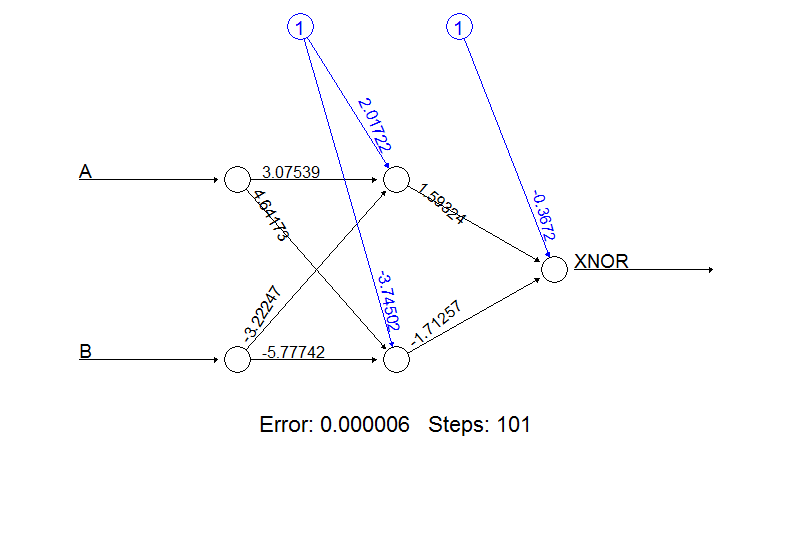
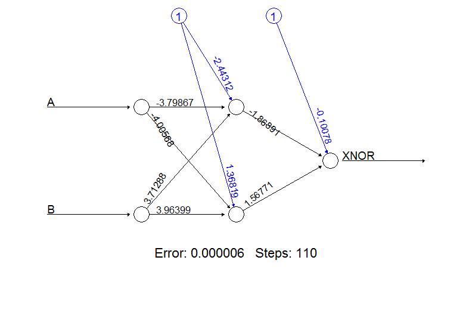

## This is a neuron

  
<div class='source'>
  Source: <a href='webspace.ship.edu'>Picture from webspace.ship.edu</a>
</div>

---
## Modeling A Neuron
 

---
## Add some dendrites
 


---
## And the axon/axon terminal

 


---
## Add some math!

 

---
## Nodes forming a network


  
<div class='source'>
  Source: <a href='www.astroml.org'>Picture from www.astroml.org</a>
</div>

---
## Neuron Activation Functions
<style>
.MathJax_Display {
  margin: 0em !important; 
}
</style>
1. Linear Neurons: <font size='28px' color=#00000>$$y=b+\sum_{i} x_{i} w_{i}$$</font>

2. Binary Threshold Neurons: <font size='28px' color=#00000 margin-top='0'>$$
z = \sum x_{i} w_{i}\\
y =
\begin{cases}
    1   & z \geq \theta \\
    0              & \text{otherwise}
\end{cases}$$</font>

3. Rectified Linear Neurons: <font size='28px' color=#00000 margin-top='0'>$$
y =
\begin{cases}
    z   & z \geq \theta \\
    0              & \text{otherwise}
\end{cases}$$</font>

---&twocol w1:50% w2:50%
## More on Binary Threshold Neurons

*** left

Binary threshold is the most common choice for modeling individual neuron nodes.
- A sigmoid distribution is often used to model the activation function.  This is the same function used in logistic regression.
- A binary threshold neuron passes a 0 or 1 value to the next layer depending on whether the activation threshold had been met.


*** right

 


---
## Back to our XNOR problem

```r
inputs <- data.frame(A=sample(c(0,1), 100,replace=TRUE),B=sample(c(0,1), 100, replace=TRUE))
inputs$XNOR <- ifelse(inputs$A == inputs$B, 1, 0)
net.xnor <- neuralnet(XNOR~A+B, data=inputs, hidden=2, rep=10)
```

 


---
## HALP!!
I needs more material??

