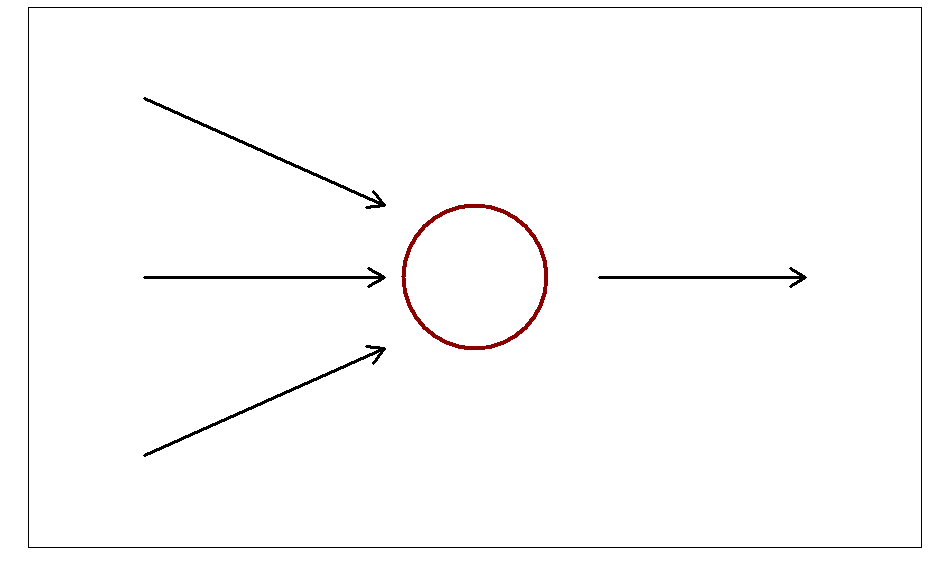
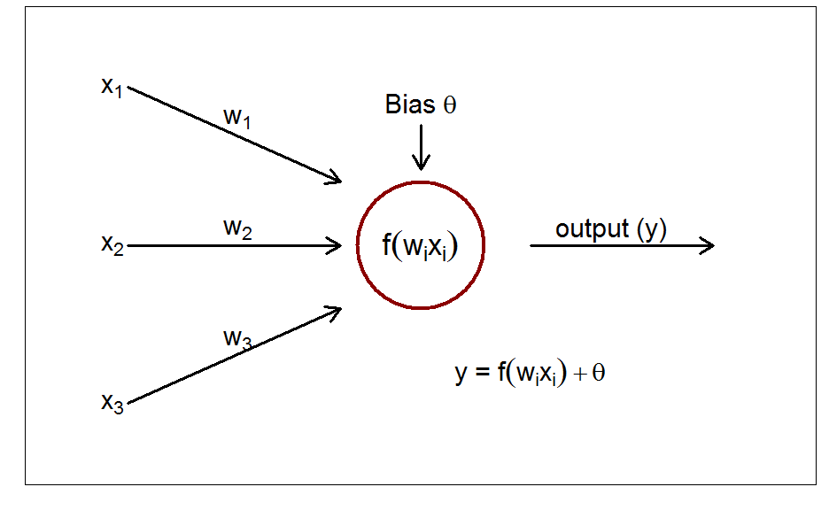
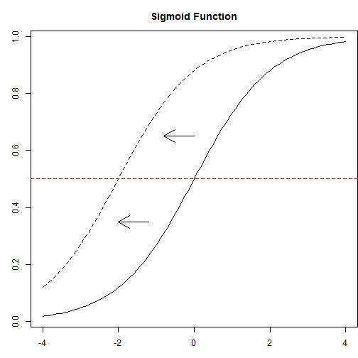

## This is a neuron


---
## Modeling A Neuron
 

---
## Add some dendrites
 


---
## And the axon/axon terminal

 


---
## Add some math!

 

---
## Nodes forming a network


---
## Back to our XNOR problem

```r
inputs <- data.frame(A=sample(c(0,1), 100,replace=TRUE),B=sample(c(0,1), 100, replace=TRUE))
inputs$XNOR <- ifelse(inputs$A == inputs$B, 1, 0)
net.xnor <- neuralnet(XNOR~A+B, data=inputs, hidden=2, rep=10)
```

 


---
